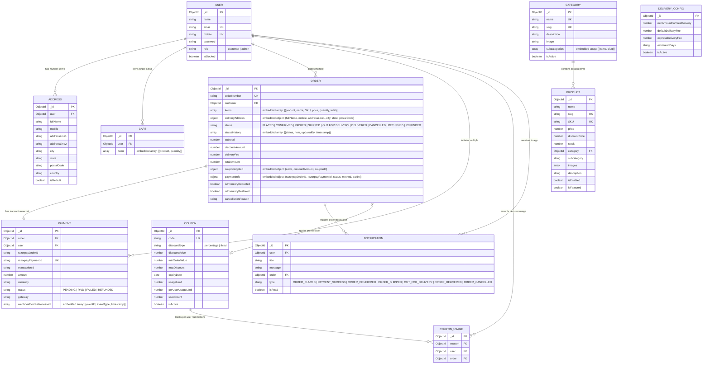

# ApexCart Entity-Relationship (ER) Architecture

```mermaid
erDiagram
    USER ||--o{ ADDRESS : "has multiple saved"
    USER ||--o{ CART : "owns single active"
    USER ||--o{ ORDER : "places multiple"
    USER ||--o{ PAYMENT : "initiates multiple"
    USER ||--o{ COUPON_USAGE : "records per-user usage"
    USER ||--o{ NOTIFICATION : "receives in-app"

    CATEGORY ||--o{ PRODUCT : "contains catalog items"

    ORDER ||--|| PAYMENT : "has transaction record"
    ORDER ||--o{ NOTIFICATION : "triggers order status alert"
    ORDER ||--o| COUPON : "applies promo code"

    COUPON ||--o{ COUPON_USAGE : "tracks per-user redemptions"

    USER {
        ObjectId _id PK
        string name
        string email UK
        string mobile UK
        string password
        string role "customer | admin"
        boolean isBlocked
    }

    ADDRESS {
        ObjectId _id PK
        ObjectId user FK
        string fullName
        string mobile
        string addressLine1
        string addressLine2
        string city
        string state
        string postalCode
        string country
        boolean isDefault
    }

    CATEGORY {
        ObjectId _id PK
        string name UK
        string slug UK
        string description
        string image
        array subcategories "embedded array: [{name, slug}]"
        boolean isActive
    }

    PRODUCT {
        ObjectId _id PK
        string name
        string slug UK
        string SKU UK
        number price
        number discountPrice
        number stock
        ObjectId category FK
        string subcategory
        array images
        string description
        boolean isEnabled
        boolean isFeatured
    }

    CART {
        ObjectId _id PK
        ObjectId user FK
        array items "embedded array: [{product, quantity}]"
    }

    ORDER {
        ObjectId _id PK
        string orderNumber UK
        ObjectId customer FK
        array items "embedded array: [{product, name, SKU, price, quantity, total}]"
        object deliveryAddress "embedded object: {fullName, mobile, addressLine1, city, state, postalCode}"
        string status "PLACED | CONFIRMED | PACKED | SHIPPED | OUT FOR DELIVERY | DELIVERED | CANCELLED | RETURNED | REFUNDED"
        array statusHistory "embedded array: [{status, note, updatedBy, timestamp}]"
        number subtotal
        number discountAmount
        number deliveryFee
        number totalAmount
        object couponApplied "embedded object: {code, discountAmount, couponId}"
        object paymentInfo "embedded object: {razorpayOrderId, razorpayPaymentId, status, method, paidAt}"
        boolean isInventoryDeducted
        boolean isInventoryRestored
        string cancellationReason
    }

    PAYMENT {
        ObjectId _id PK
        ObjectId order FK
        ObjectId user FK
        string razorpayOrderId
        string razorpayPaymentId UK
        string transactionId
        number amount
        string currency
        string status "PENDING | PAID | FAILED | REFUNDED"
        string gateway
        array webhookEventsProcessed "embedded array: [{eventId, eventType, timestamp}]"
    }

    COUPON {
        ObjectId _id PK
        string code UK
        string discountType "percentage | fixed"
        number discountValue
        number minOrderValue
        number maxDiscount
        date expiryDate
        number usageLimit
        number perUserUsageLimit
        number usedCount
        boolean isActive
    }

    COUPON_USAGE {
        ObjectId _id PK
        ObjectId coupon FK
        ObjectId user FK
        ObjectId order FK
    }

    DELIVERY_CONFIG {
        ObjectId _id PK
        number minAmountForFreeDelivery
        number defaultDeliveryFee
        number expressDeliveryFee
        string estimatedDays
        boolean isActive
    }

    NOTIFICATION {
        ObjectId _id PK
        ObjectId user FK
        string title
        string message
        ObjectId order FK
        string type "ORDER_PLACED | PAYMENT_SUCCESS | ORDER_CONFIRMED | ORDER_SHIPPED | OUT_FOR_DELIVERY | ORDER_DELIVERED | ORDER_CANCELLED"
        boolean isRead
    }
```
